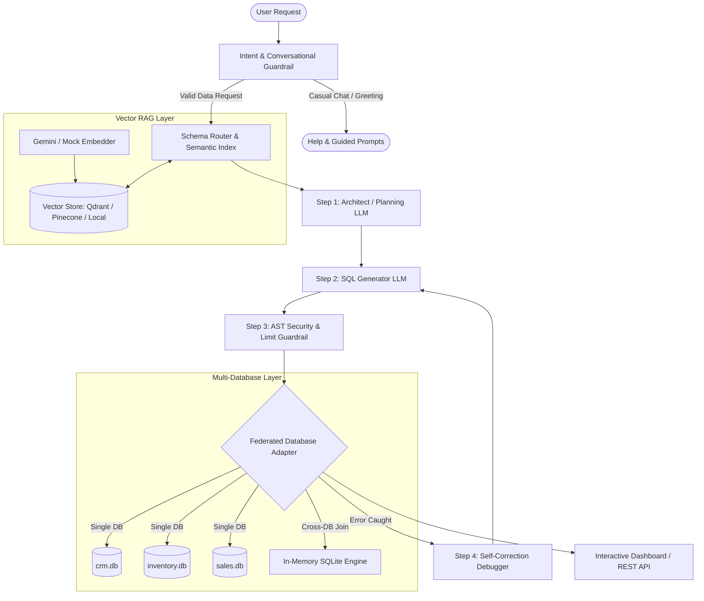

# System Architecture & Technical Specifications

The **NLP-SQL Federated Engine** converts ambiguous Natural Language questions into precise SQL queries, routes them across multiple disjoint databases (CRM, Inventory, Sales), performs in-memory cross-database joins, and validates query safety.

---

## 1. High-Level Architectural Diagram

---

## 2. Core Architectural Pillars

### A. Intent & Conversational Guardrail (`nlp_sql_engine/core/security/intent_guardrail.py`)
- Intercepts non-database queries (`"Hello"`, `"Help"`, `"What can you do?"`, chit-chat) **before** invoking LLMs or executing SQL.
- Prevents database hallucinations and saves API tokens.

### B. Auto Schema Discovery & Relationship Linker (`nlp_sql_engine/services/schema_discovery.py`)
- Introspects connected physical databases dynamically on boot.
- Infers foreign keys and cross-database joins via naming heuristics (`orders.customer_id` ⟷ `customers.id`).
- Removes the need for manual virtual schema definitions.

### C. AST SQL Security Guardrail (`nlp_sql_engine/core/security/guardrail.py`)
- Parses SQL Abstract Syntax Trees (AST) using `sqlglot`.
- Enforces strict read-only execution (`SELECT` only).
- Blocks destructive operations (`DROP`, `DELETE`, `UPDATE`, `INSERT`, `ALTER`, `TRUNCATE`).
- Enforces safe query limits to prevent out-of-memory crashes.

### D. Federated Multi-Database Execution (`nlp_sql_engine/infra/database/federated_adapter.py`)
- **Single DB Routing**: If all referenced tables reside in a single database (e.g. `inventory.products`), queries are transpiled and pushed down directly to that database engine.
- **Cross-DB In-Memory Joins**: If queries span multiple disjoint databases (e.g. `sales.orders` joined with `crm.customers`), data slices are pulled concurrently and joined in an isolated in-memory SQLite virtual instance.

### E. Self-Correction Feedback Loop (`nlp_sql_engine/use_cases/ask_question.py`)
- If the database engine returns a syntax or execution error, the `Debugger` step automatically inspects the error message, schema, and failed SQL to refine and regenerate a working query.

---

## 3. Supported Infrastructure Providers

| Component | Registered Providers |
| :--- | :--- |
| **LLM Engine** | `openrouter` (OpenRouter API), `openai` (OpenAI API), `local` (LM Studio / Ollama), `mock` |
| **Embeddings** | `gemini` (Google AI Studio `text-embedding-004` / `gemini-embedding-001`), `openai`, `huggingface`, `mock` |
| **Vector Store** | `local` (NumPy vectorized cosine similarity), `qdrant` (Qdrant Cloud/Local), `pinecone` (Pinecone Cloud) |
| **Database** | `federated` (Multi-DB orchestrator), `sqlalchemy`, `sqlite` |
